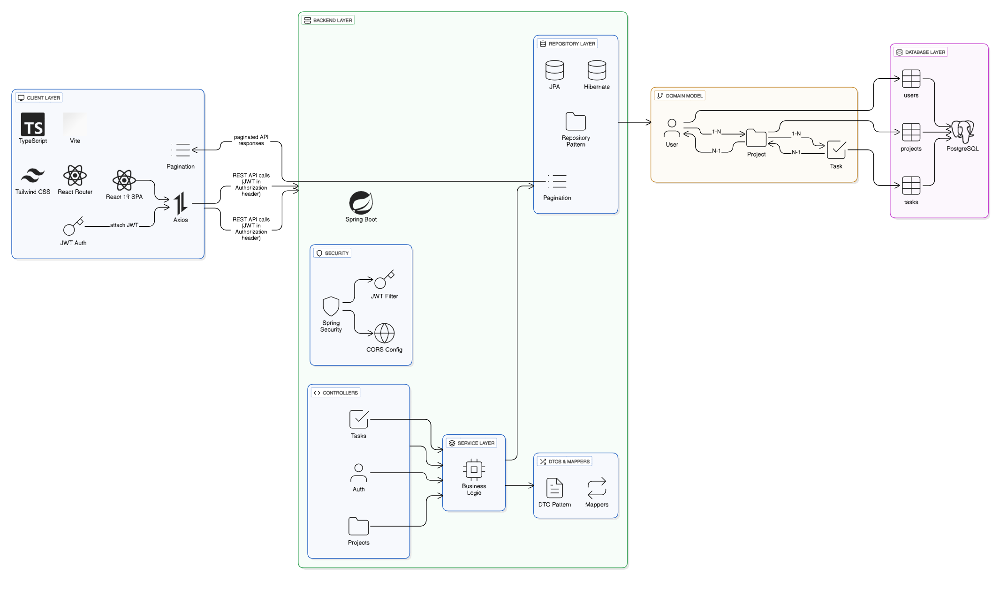

# TaskFlow - Project & Task Management System

A full-stack project management application built with Spring Boot, React, and PostgreSQL. Manage your projects and tasks with an intuitive interface, real-time progress tracking, and secure authentication.

## Features

### Secure Authentication
JWT-based authentication system ensuring your data is protected. Login with email and password to access your personalized workspace.

### Project Management
- Create and organize unlimited projects with titles and descriptions
- View all projects in one centralized dashboard
- Search projects quickly with built-in search functionality
- Paginated project lists for efficient browsing

### Task Organization
- Add detailed tasks to each project with titles, descriptions, and due dates
- Filter tasks based on their status (pending/completed)
- Mark tasks as completed with a single click
- Keep everything organized and on track

### Progress Tracking
Real-time progress calculation showing total tasks, completed tasks, and completion percentage for each project with visual progress bars and statistics.

### CRUD Operations
- **Create**: Launch new projects and tasks instantly
- **Read**: View all projects, tasks, and their details
- **Update**: Modify project and task information whenever needed
- **Delete**: Remove tasks or projects that are no longer needed

### Technical Highlights
- Clean architecture with separation of concerns
- RESTful API design
- Comprehensive input validation
- Robust error handling
- Real-time updates and feedback
- Responsive design for all devices
- Modern, intuitive user interface

## Architecture Overview

### System Architecture



<!-- If the image above doesn't display, here's the text representation: -->
<details>
<summary>Text-based Architecture Diagram (Click to expand)</summary>

```
┌─────────────────────────────────────────────────────────────┐
│                         Client Layer                         │
│  ┌────────────────────────────────────────────────────────┐ │
│  │   React 19 + TypeScript + Tailwind CSS + Vite         │ │
│  │   (SPA with React Router for navigation)              │ │
│  └────────────────────────────────────────────────────────┘ │
└──────────────────────┬──────────────────────────────────────┘
                       │ HTTP/REST (Axios)
                       │ JWT Token in Headers
                       ▼
┌─────────────────────────────────────────────────────────────┐
│                      API Gateway Layer                       │
│  ┌────────────────────────────────────────────────────────┐ │
│  │   Spring Security + JWT Authentication Filter         │ │
│  │   CORS Configuration                                   │ │
│  └────────────────────────────────────────────────────────┘ │
└──────────────────────┬──────────────────────────────────────┘
                       │
                       ▼
┌─────────────────────────────────────────────────────────────┐
│                     Backend Layer (Spring Boot)              │
│  ┌─────────────────┐  ┌──────────────┐  ┌────────────────┐ │
│  │   Controllers   │  │   Services   │  │  Repositories  │ │
│  │  (REST API)     │→ │  (Business   │→ │  (Data Access) │ │
│  │  - Auth         │  │   Logic)     │  │  - JPA/Hibernate│ │
│  │  - Projects     │  │  - Auth      │  │                │ │
│  │  - Tasks        │  │  - Projects  │  │                │ │
│  └─────────────────┘  │  - Tasks     │  └────────────────┘ │
│                       └──────────────┘                       │
│  ┌─────────────────────────────────────────────────────────┐ │
│  │   DTOs & Mappers (Data Transfer Objects)               │ │
│  └─────────────────────────────────────────────────────────┘ │
│  ┌─────────────────────────────────────────────────────────┐ │
│  │   Entities (JPA Models with Relationships)             │ │
│  │   - User (1:N Projects)                                │ │
│  │   - Project (1:N Tasks, N:1 User)                      │ │
│  │   - Task (N:1 Project)                                 │ │
│  └─────────────────────────────────────────────────────────┘ │
└──────────────────────┬──────────────────────────────────────┘
                       │ JDBC
                       ▼
┌─────────────────────────────────────────────────────────────┐
│                    Database Layer (PostgreSQL)               │
│  ┌────────────┐  ┌────────────┐  ┌─────────────┐           │
│  │   Users    │  │  Projects  │  │    Tasks    │           │
│  │   Table    │  │   Table    │  │    Table    │           │
│  └────────────┘  └────────────┘  └─────────────┘           │
└─────────────────────────────────────────────────────────────┘
```
</details>

### Data Flow

**Authentication Flow:**
1. User submits credentials → Auth Controller
2. Service validates credentials and generates JWT token
3. Token returned to client and stored
4. Subsequent requests include JWT in Authorization header
5. Security filter validates token and extracts user identity

**Project/Task Management Flow:**
1. Client sends request with JWT → Controller layer
2. Controller validates input and calls Service layer
3. Service applies business logic and calls Repository
4. Repository performs database operations via JPA
5. Data mapped to DTOs and returned to client

### Key Design Patterns

- **Layered Architecture**: Clear separation between presentation, business, and data layers
- **Repository Pattern**: Data access abstraction using Spring Data JPA
- **DTO Pattern**: Decoupling internal entities from API contracts
- **Dependency Injection**: Spring's IoC container manages component lifecycle
- **RESTful Design**: Resource-based endpoints with proper HTTP methods

## Tools & Technologies

### Backend
- **Java**: 21
- **Spring Boot**: 4.0.0
- **Spring Security**: JWT-based authentication
- **Spring Data JPA**: Database ORM
- **PostgreSQL**: 17.2
- **Maven**: 3.9.11
- **Lombok**: 1.18.42
- **JUnit & Mockito**: Unit testing

### Frontend
- **React**: 19.2.0
- **TypeScript**: 5.9.3
- **Vite**: 7.2.4
- **Tailwind CSS**: 4.1.18
- **React Router**: 7.10.1
- **Axios**: 1.13.2
- **Lucide React**: 0.561.0

### Database
- **PostgreSQL**: 17.2-alpine

### DevOps
- **Docker**: Containerization
- **Docker Compose**: Multi-container orchestration

## Prerequisites

- Java 21 or higher
- Node.js 20.18.1 or higher
- PostgreSQL 17.2 or higher
- Maven 3.9.11 or higher
- npm or yarn
- Docker & Docker Compose (for containerized deployment)

## Database Setup

1. **Install PostgreSQL**
   ```bash
   # On macOS with Homebrew
   brew install postgresql@17
   
   # On Ubuntu/Debian
   sudo apt-get install postgresql-17
   
   # On Windows, download from https://www.postgresql.org/download/
   ```

2. **Start PostgreSQL Service**
   ```bash
   # On macOS
   brew services start postgresql@17
   
   # On Ubuntu/Debian
   sudo systemctl start postgresql
   
   # On Windows, PostgreSQL runs as a service automatically
   ```

3. **Create Database and User**
   ```bash
   # Access PostgreSQL
   psql -U postgres
   
   # In PostgreSQL shell, run:
   CREATE DATABASE taskflow_db;
   CREATE USER taskflow_user WITH PASSWORD 'your_password';
   GRANT ALL PRIVILEGES ON DATABASE taskflow_db TO taskflow_user;
   \q
   ```

4. **Create Environment File**
   
   Create a `.env` file in the project root:
   ```env
   # Database Configuration
   POSTGRES_DB=taskflow_db
   POSTGRES_USER=taskflow_user
   POSTGRES_PASSWORD=your_password
   
   # Spring Boot Configuration
   SPRING_DATASOURCE_URL=jdbc:postgresql://localhost:5432/taskflow_db
   SPRING_DATASOURCE_USERNAME=taskflow_user
   SPRING_DATASOURCE_PASSWORD=your_password
   
   # JWT Configuration
   JWT_SECRET=your_jwt_secret_key_min_256_bits_base64_encoded
   JWT_EXPIRATION=86400000
   ```

## Backend Setup & Run

1. **Navigate to Backend Directory**
   ```bash
   cd backend-ptm
   ```

2. **Configure Application Properties**
   
   The application uses environment variables. Ensure your `.env` file is set up (see Database Setup step 4).

3. **Build the Project**
   ```bash
   ./mvnw clean install
   
   # On Windows
   mvnw.cmd clean install
   ```

4. **Run the Application**
   ```bash
   ./mvnw spring-boot:run
   
   # On Windows
   mvnw.cmd spring-boot:run
   ```

   The backend server will start on `http://localhost:8080`

## Frontend Setup & Run

1. **Navigate to Frontend Directory**
   ```bash
   cd frontend-ptm
   ```

2. **Install Dependencies**
   ```bash
   npm install
   ```

3. **Configure Environment**
   
   Create a `.env` file in the `frontend-ptm` directory:
   ```env
   VITE_API_URL=http://localhost:8080/api
   ```

4. **Run Development Server**
   ```bash
   npm run dev
   ```

   The frontend will start on `http://localhost:5173`

5. **Build for Production**
   ```bash
   npm run build
   ```

6. **Preview Production Build**
   ```bash
   npm run preview
   ```

## Docker Setup

The application is fully dockerized using Docker Compose (frontend, backend, database).

### Status
The containers build and start correctly. Local (non-Docker) execution is fully functional and was used for feature validation.

**Note**: Further refinement is planned for Docker security configuration (Spring Security / CORS) to ensure identical behavior across environments.

### Running with Docker

1. **Ensure `.env` file is configured** (see Database Setup step 4)

2. **Build and Start Services**
   ```bash
   docker-compose up -d --build
   ```

3. **View Logs**
   ```bash
   # All services
   docker-compose logs -f
   
   # Specific service
   docker-compose logs -f backend
   ```

4. **Stop Services**
   ```bash
   docker-compose down
   ```

5. **Stop Services and Remove Volumes**
   ```bash
   docker-compose down -v
   ```

6. **Access the Application**
   - Frontend: `http://localhost:5173`
   - Backend API: `http://localhost:8080/api`
   - Database: `localhost:5432`

### Docker Services

- **frontend**: React development server with Vite
- **backend**: Spring Boot application with JWT authentication
- **database**: PostgreSQL 17.2-alpine with persistent volume

## Testing

### Backend Testing

Unit tests are implemented for service, mapper, and security layers using JUnit and Mockito.

**Run all tests:**
```bash
cd backend-ptm
./mvnw test

# On Windows
mvnw.cmd test
```

**Run tests with coverage:**
```bash
./mvnw test jacoco:report
```

**Test Structure:**
```
backend-ptm/src/test/java/com/example/project_task_manager/
├── ProjectTaskManagerApplicationTests.java
├── mapper/
│   ├── ProjectMapperTest.java
│   └── TaskMapperTest.java
├── security/
│   └── JwtServiceTest.java
└── service/
    ├── AuthServiceTest.java
    ├── ProjectServiceTest.java
    └── TaskServiceTest.java
```

**Test Configuration:**
- H2 in-memory database for testing (`application-test.properties`)
- Mockito for mocking dependencies
- JUnit 5 for test framework

**Test Coverage:**
- **Service Layer**: Business logic, authentication, project/task operations
- **Mapper Layer**: DTO to Entity conversions and vice versa
- **Security Layer**: JWT token generation, validation, and extraction
- **Repository Operations**: Mocked using Mockito for isolation

## API Endpoints

### Authentication
- `POST /api/auth/register` - Register new user
- `POST /api/auth/login` - Login user

### Projects
- `GET /api/projects` - Get paginated projects
- `GET /api/projects/all` - Get all projects
- `GET /api/projects/recent` - Get recently modified projects
- `GET /api/projects/{id}` - Get project by ID
- `POST /api/projects` - Create new project
- `PUT /api/projects/{id}` - Update project
- `DELETE /api/projects/{id}` - Delete project

### Tasks
- `GET /api/projects/{projectId}/tasks` - Get all tasks for a project
- `GET /api/projects/{projectId}/tasks/{taskId}` - Get task by ID
- `POST /api/projects/{projectId}/tasks` - Create new task
- `PUT /api/projects/{projectId}/tasks/{taskId}` - Update task
- `PATCH /api/projects/{projectId}/tasks/{taskId}/complete` - Mark task as completed
- `DELETE /api/projects/{projectId}/tasks/{taskId}` - Delete task

## Default Credentials

No default credentials are seeded. You must register a new account through the signup page.

## Project Structure

```
project-task-manager/
├── backend-ptm/           # Spring Boot backend
│   ├── src/
│   │   ├── main/
│   │   │   ├── java/
│   │   │   │   └── com/example/project_task_manager/
│   │   │   │       ├── config/
│   │   │   │       ├── controller/
│   │   │   │       ├── dto/
│   │   │   │       ├── entity/
│   │   │   │       ├── mapper/
│   │   │   │       ├── repository/
│   │   │   │       ├── security/
│   │   │   │       └── service/
│   │   │   └── resources/
│   │   └── test/
│   │       └── java/
│   │           └── com/example/project_task_manager/
│   │               ├── service/
│   │               └── controller/
│   ├── pom.xml
│   └── Dockerfile
│
├── frontend-ptm/          # React frontend
│   ├── src/
│   │   ├── components/
│   │   ├── layouts/
│   │   ├── pages/
│   │   ├── services/
│   │   ├── App.tsx
│   │   └── main.tsx
│   ├── package.json
│   ├── vite.config.ts
│   └── Dockerfile
│
├── docker-compose.yml
└── .env
```
